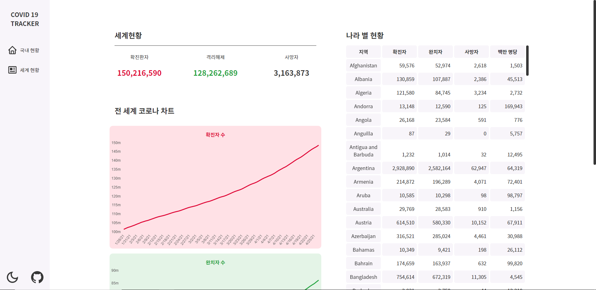
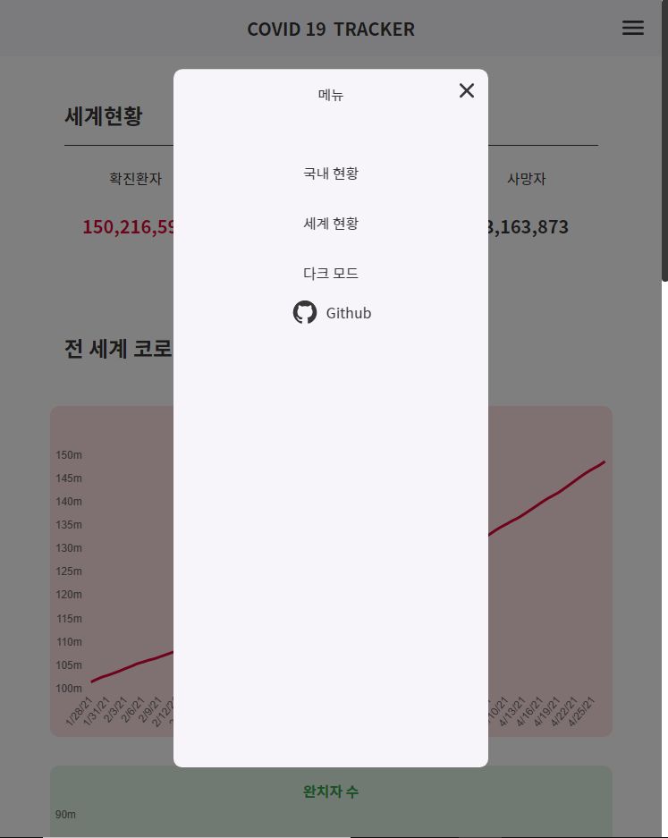

# ⚫COVID19 TRACKER
국내, 전 세계의 코로나 감염 현황을 한 눈에 볼 수 있는 기능을 제공합니다.

[사이트 바로가기](https://tlatjdgh3778.github.io/covid19/)
<!-- 사이트 잠시 닫음 -->

## 주요 기능
* 국내, 해외의 코로나 감염 현황 제공
* leaflet 과 GeoJson 을 활용한 맵 제작과 시 도별 현황 표시
* Chartjs 를 사용해 해외 감염 현황 차트로 표시
* 모바일에서도 동작하는 반응형 구현
* 다크 모드 구현

## 스크린샷
|                국내 현황                 |              세계 현황                    |
| ---------------------------------------- | ---------------------------------------- |
| | |

|              국내 현황(모바일)            |           메뉴 화면(모바일)               |
| ---------------------------------------- | ---------------------------------------- |
| | |

## 기술 스택
* React
* Styled-Components
* Chartjs
* leaflet API

## 프로젝트를 하며 배운 지식
* Chartjs 를 사용해 간단한 차트를 그리는 방법
* leaflet API 와 GeoJson 을 사용해 지도를 그리는 방법
* Styled-Components를 사용해서 각 컴포넌트를 따로 스타일링 하는 방법
* React-Router-dom 을 사용하는 방법
